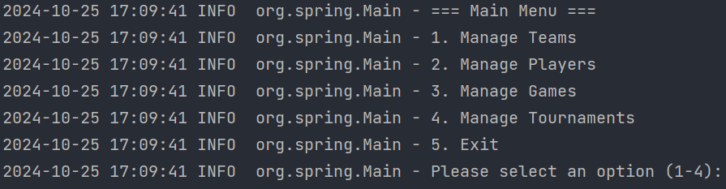
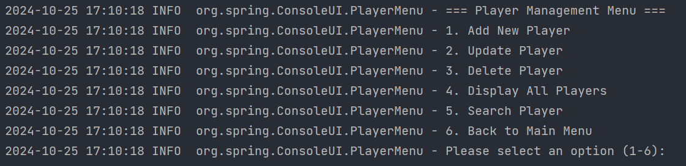
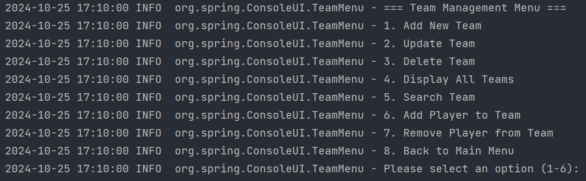

# PLAY-OF-PRO Tournament Management Application

## Project Description

This application is designed for an organization to manage video game tournaments by tracking and organizing players, teams, and tournaments. With features to create, update, and display tournament information, this tool enables a smooth and efficient management experience for administrators and organizers.

## General Objective

The primary goal of this application is to provide an intuitive and reliable platform to manage:
- **Players:** Register, update, delete, and display player information.
- **Teams:** Create, modify, add/remove players, and display team details.
- **Tournaments:** Create, update, add/remove teams, and view tournament information, estimated durations, and schedules.

## Technologies Used

- **Java 8** for application development
- **Maven** for dependency management
- **Spring Core** for Inversion of Control (IoC) and Dependency Injection (DI) via XML configuration
- **JPA/Hibernate** for database interaction
- **JUnit** and **Mockito** for unit testing
- **JaCoCo** for code coverage measurement
- **H2 Database** for an in-memory database solution
- **SLF4J** for logging with Java's native logging
- **Git** for version control
- **JIRA** for Scrum-based project management

## Project Structure

The project is organized into several layers to maintain clean separation and manageability:

1. **Model Layer:** Contains JPA entities.
2. **Repository Layer:** Manages database operations via JPA and Hibernate.
3. **Service Layer:** Contains business logic and application services.
4. **Utility Layer:** Provides common helper functions.
5. **Presentation Layer:** Contains the main console menu class for user interactions.
6. **Configuration Files:**
    - **applicationContext.xml:** Spring configuration
    - **pom.xml:** Maven dependencies
    - **persistence.xml:** JPA and H2 database settings

### Main Classes Overview

- **Player**: Represents a player with properties such as `pseudo`, `age`, and `team`.
- **Team**: Manages team details, players, tournaments, and rankings.
- **Tournament**: Contains tournament information, including title, game, start and end dates, number of spectators, participating teams, estimated duration, and status.
- **Game**: Represents the game with properties such as name, difficulty, and average match duration.

## Installation and Usage Instructions

### Prerequisites

- **Java 8**
- **Maven**
- **IDE** (e.g., IntelliJ, Eclipse)
- **Git** for version control

### Database Configuration Steps

1. **Setup H2 Database**: The application uses an H2 database configured via `persistence.xml` for persistent storage.
2. **Configure Application Context**: Ensure the `applicationContext.xml` is properly set up for Spring dependency injection.

### Running the Application

1. **Clone the Repository**:
    ```bash
    git clone <repository-url>
    ```
2. **Install Dependencies**:
    ```bash
    mvn clean install
    ```
3. **Run the Application**:
    ```bash
    java -jar target/Play-Of-Pro-1.0-SNAPSHOT.jar
    ```
4. **Console Menu**: Interact with the application using the console menu. Use the menu to add players, create teams, manage tournaments, and display statistics.

### Screenshots

Include screenshots of key functionalities:






## Potential Future Enhancements

Some ideas to expand or improve the project:

- **Web-Based User Interface**: Transition to a web UI to improve accessibility.
- **Advanced Analytics**: Provide detailed statistics on player/team performance and tournament trends.
- **Automated Match Scheduling**: Implement advanced scheduling algorithms based on team availability.
- **Extended Tournament Statuses**: Implement more granular statuses (e.g., “Pending Approval”) for enhanced tracking.

## Author and Contact

**Idelkadi Radia**  
For questions or feedback, please reach out at [idelkadiradia@gmail.com].
